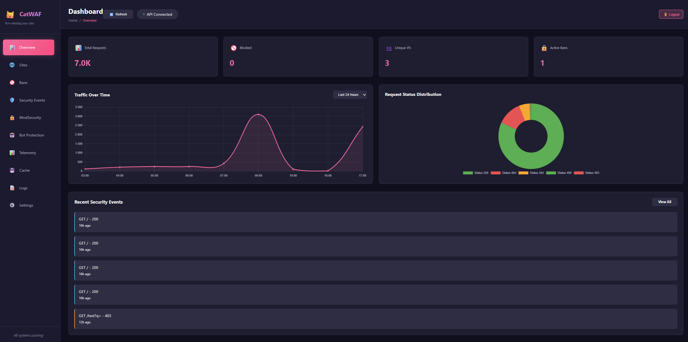
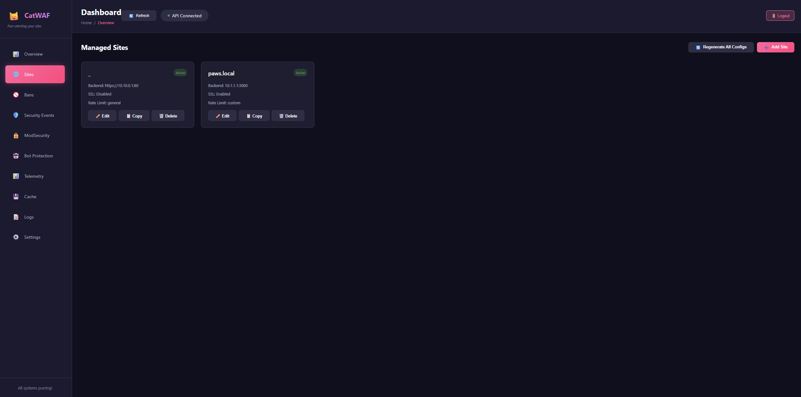
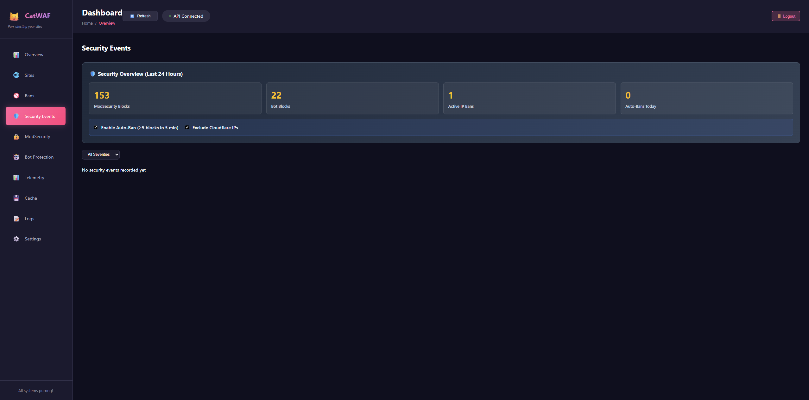
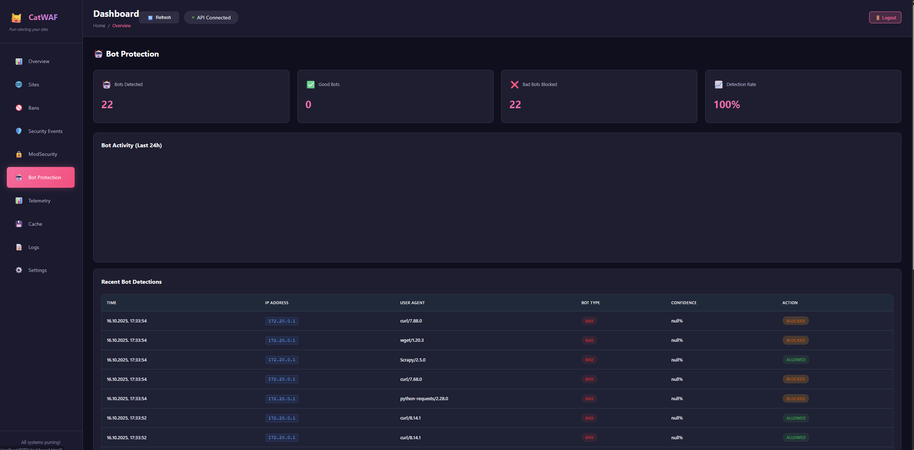
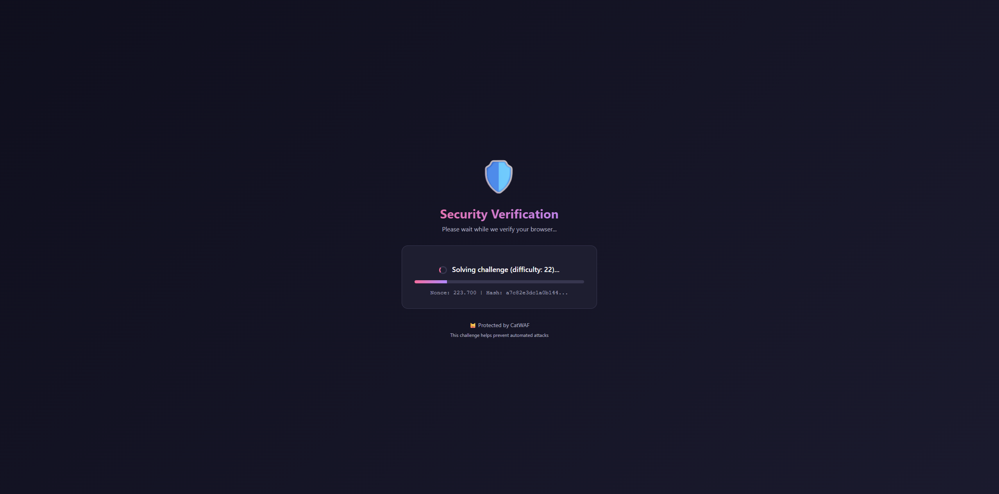

# CatWAF - Web Application Firewall

A production-ready Web Application Firewall with NGINX + ModSecurity v3, automated threat protection, and a beautiful catboy-themed dashboard. Protect your websites from SQL injection, XSS, DDoS attacks, malicious bots, and more with enterprise-grade security wrapped in a cute catboy aesthetic.

> ⚠️ **AI-Generated Project Disclaimer**  
> This project was largely generated with AI assistance (Claude 4.5 Sonnet + GitHub Copilot) and should be considered **feature-complete but experimental**. While functional and tested, it may contain bugs, security issues, or unexpected behaviors. Use in production at your own risk and review the code before deploying to critical infrastructure.

[](https://modsecurity.org/)
[-blue)](https://coreruleset.org/)
[](https://nginx.org/)
[](https://php.net/)
[](https://mariadb.org/)

---

## Quick Start

### Option 1: Pre-Built Images (Fastest - 2 minutes)
```bash
git clone https://github.com/smol-kitten/cat-waf
cd cat-waf
docker-compose -f docker-compose.prebuilt.yml up -d
```
📖 **See [`QUICKSTART.md`](QUICKSTART.md) for detailed instructions**

### Option 2: Build Locally (5-10 minutes)
```bash
git clone https://github.com/smol-kitten/cat-waf
cd cat-waf

# Configure environment
cp .env.example .env
nano .env  # Set DASHBOARD_API_KEY, DB_PASSWORD, ACME_EMAIL

# Start all services
docker compose up -d --build
```

**Dashboard Access**: http://localhost:8080  
**First login**: Use `DASHBOARD_API_KEY` from `.env` file

---

## Key Features

### Enterprise Security
- **ModSecurity v3** - OWASP Core Rule Set v4.20 (677 rules) protecting against SQL injection, XSS, RCE, and 50+ attack types
- **JavaScript Challenge** - SHA-256 proof-of-work DDoS protection with configurable difficulty (16-24 bits)
- **Bot Protection** - 100+ pattern detection with good bot whitelist (Google, Bing, etc.) and bad bot blocking
- **Fail2Ban** - Automated IP banning after repeated attacks with manual ban/unban controls
- **Rate Limiting** - 4 preset zones (general, strict, API, custom) with per-site configuration
- **GeoIP Filtering** - MaxMind GeoIP2 database integration with country-level blocking

### Beautiful Dashboard
- **11 Pages** - Overview, Sites, Security Events, ModSecurity, Bot Protection, IP Bans, Cache, Telemetry, Logs, Settings
- **Live Editing** - Auto-save changes 800ms after typing stops, no save button needed
- **Real-Time Stats** - Total requests, attacks blocked, cache hit rate, response times
- **Catboy Theme** - Custom pink/purple gradient design with cute catboy aesthetic
- **Responsive** - Works on desktop, tablet, and mobile devices

### Performance & Optimization
- **Brotli Compression** - 10-20% better compression than gzip for faster page loads
- **Proxy Caching** - Configurable cache duration per site with cache statistics
- **Static File Caching** - 10x cache duration for images, CSS, JS files
- **Image Optimization** - On-the-fly resize and quality reduction (JPEG)
- **GoAccess Analytics** - Real-time visitor statistics with embedded dashboard

### Easy Management
- **One-Click Site Setup** - Add protected sites in seconds with automatic NGINX config generation
- **4 SSL Options** - Let's Encrypt (HTTP-01 & DNS-01), Snakeoil (self-signed), Custom certificates
- **7-Tab Site Editor** - General, Security, Performance, Backends, SSL/TLS, Access Control, Advanced
- **Custom Error Pages** - Built-in catboy templates or custom URLs (403, 404, 429, 500)
- **REST API** - 17+ endpoints for automation and integration

---

## Complete Documentation

### Getting Started
- **[SETUP.md](_git/SETUP.md)** - Complete installation guide with prerequisites, environment configuration, Docker setup, and troubleshooting
- **[QUICKREF.md](_git/QUICKREF.md)** - Quick reference card for daily operations (Docker commands, SSL setup, security operations, compression)

### Reference & Features
- **[FEATURES.md](_git/FEATURES.md)** - Complete feature list with implementation status (✅ Complete, 🔧 Partial, 📋 Planned) and dashboard screenshots

### Project Development
- **[SUMMARY.md](_git/SUMMARY.md)** - Project development summary, architecture overview, and technical decisions
- **[CHANGELOG.md](CHANGELOG.md)** - Version history and release notes with detailed change tracking
- **[TODO.md](TODO.md)** - Development roadmap and planned features for future releases

---

## Dashboard Screenshots

### Main Dashboard

*Real-time statistics, request graphs, and system status*

### Sites Management

*Add, edit, and manage protected sites with live editing*

### Security Events

*ModSecurity events with severity filtering and GeoIP data*

### Bot Protection

*Good/bad bot detection and activity tracking*

### JavaScript Challenge

*Proof-of-work challenge for DDoS protection*

**More screenshots**: [ModSecurity](_git/img/modsecurity.png) • [IP Bans](_git/img/ipbans.png) • [Cache Management](_git/img/cachemanagement.png) • [Telemetry](_git/img/telemetry.png) • [System Logs](_git/img/systemlogs.png) • [Settings](_git/img/settings.png)

---

## SSL/TLS Certificate Options

| Type | Best For | Setup Time | Production Ready |
|------|----------|------------|------------------|
| **Snakeoil** (Self-signed) | Testing, internal | Instant ✨ | Dev only |
| **Let's Encrypt HTTP-01** | Public websites | 1 minute | ✅ Yes |
| **Let's Encrypt DNS-01** | Wildcards, private+public | 2 minutes | ✅ Yes |
| **Custom Certificate** | Corporate CA, purchased | 5 minutes | ✅ Yes |

**Snakeoil**: Auto-generated on first start, 10-year validity, perfect for quick HTTPS testing  
**Let's Encrypt**: Automated via ACME container with HTTP-01 and DNS-01 (Cloudflare) support  
**Custom**: Upload your own certificates from any CA

---

## Architecture & Components

### Docker Stack (7 Containers)
- **nginx** - Reverse proxy with ModSecurity v3, bot protection, rate limiting
- **dashboard** - PHP 8.2-FPM + NGINX API server for site management
- **web-dashboard** - Static frontend with vanilla JavaScript and catboy theme
- **mariadb** - Database for sites, security events, bans, and bot detection
- **log-parser** - PHP service for parsing NGINX/ModSecurity logs
- **fail2ban** - Automated IP banning based on security events
- **default-backend** - Fallback backend server for testing

### Key Technologies
- **NGINX 1.25-alpine** - High-performance reverse proxy
- **ModSecurity v3** - Web Application Firewall engine
- **OWASP CRS v4.20** - Core Rule Set with 677 security rules
- **PHP 8.2** - Backend API and log processing
- **MariaDB 11.8** - Relational database
- **Fail2Ban** - Intrusion prevention
- **GoAccess** - Real-time analytics

---

## What's New

### JavaScript Challenge (October 2025)
Protect your sites from DDoS attacks with client-side proof-of-work:
- Configurable difficulty (16 = easy, 24 = extreme)
- Beautiful challenge UI with progress bar
- Server-side validation prevents URL manipulation
- Cookie-based validation with configurable duration
- Optional Cloudflare IP bypass

### Custom Error Pages
Choose between built-in catboy-themed templates or your own:
- Template mode: Beautiful built-in error pages (403, 404, 429, 500)
- Custom mode: Use your own URLs (internal paths or external URLs)
- Per-site configuration in Advanced tab

### Brotli Compression
Better compression than gzip for faster page loads:
- 10-20% smaller files than gzip
- Supported by all modern browsers
- Configurable compression level (1-9)
- Auto-fallback to gzip for older browsers

### Live Editing
Edit site settings without clicking save:
- Auto-save changes 800ms after typing stops
- Instant save for toggles and selects
- Visual save status indicator
- No more "unsaved changes" warnings

---

## Access Points

- **Dashboard**: http://localhost:8080 (API key from `.env`)
- **NGINX Proxy**: http://localhost:8081 (proxied sites)
- **MariaDB**: localhost:3307 (credentials from `.env`)

---

## Requirements

- Docker 20.10+ & Docker Compose 2.0+
- 4GB RAM minimum (8GB recommended)
- 10GB free disk space
- Linux, macOS, or Windows with WSL2
> ⚠️ I actually have no clue runs fine with a gig of RAM and 2vCPUs on my test instance with 1-5k requests/h with all features enabled and barely any load. Your mileage may vary.

---

## License

This project is provided as-is without warranty. Review and test thoroughly before production use.

---

## Support & Contributing

For detailed setup instructions, troubleshooting, and configuration guides, see:
- [SETUP.md](_git/SETUP.md) - Installation and configuration
- [QUICKREF.md](_git/QUICKREF.md) - Quick command reference
- [FEATURES.md](_git/FEATURES.md) - Complete feature list

Contributions, bug reports, and feature requests are welcome!
